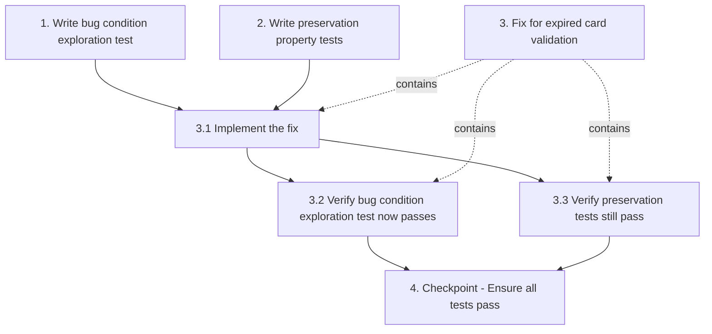

# Implementation Plan

## Overview

This task list implements the expired card filter bugfix following the bug condition methodology. The fix adds expiration date validation to reject expired cards while preserving all existing validation and processing behavior for non-expired cards.

## Tasks

- [x] 1. Write bug condition exploration test
  - **Property 1: Bug Condition** - Expired Cards Are Accepted
  - **CRITICAL**: This test MUST FAIL on unfixed code - failure confirms the bug exists
  - **DO NOT attempt to fix the test or the code when it fails**
  - **NOTE**: This test encodes the expected behavior - it will validate the fix when it passes after implementation
  - **GOAL**: Surface counterexamples that demonstrate the bug exists
  - **Scoped PBT Approach**: Scope the property to concrete failing cases: cards with expiration dates in the past (year < current year OR (year == current year AND month < current month))
  - Test that cards with expired dates are currently accepted and stored (from Bug Condition in design)
  - The test assertions should match the Expected Behavior Properties from design: expired cards should be rejected and NOT stored
  - Test cases to include:
    - Card with expiration `12/2023` processed in 2024 (past year)
    - Card with expiration `03/2024` processed in May 2024 (past month, same year)
    - Card with expiration `01/2023` processed in December 2024 (edge case)
  - Run test on UNFIXED code
  - **EXPECTED OUTCOME**: Test FAILS (this is correct - it proves the bug exists)
  - Document counterexamples found: expired cards are accepted and stored in extracted_cards.txt and StateManager
  - Mark task complete when test is written, run, and failure is documented
  - _Requirements: 2.2, 2.3_

- [x] 2. Write preservation property tests (BEFORE implementing fix)
  - **Property 2: Preservation** - Non-Expired Card Processing
  - **IMPORTANT**: Follow observation-first methodology
  - Observe behavior on UNFIXED code for non-buggy inputs (cards with valid expiration dates)
  - Write property-based tests capturing observed behavior patterns from Preservation Requirements
  - Property-based testing generates many test cases for stronger guarantees
  - Test cases to include:
    - Future year cards (year > current year) are accepted and processed
    - Future month same year cards (year == current year AND month > current month) are accepted
    - Current month cards (year == current year AND month == current month) are accepted
    - Luhn validation failures continue to reject cards regardless of expiration date
    - Network filter (cards not starting with '4' or '5') continues to reject cards
    - Obfuscation preserves first 12 digits and generates Luhn-valid ending
    - Month normalization pads single-digit months with leading zero
    - Year normalization prefixes 2-digit years with "20"
    - CVV handling preserves original 3-digit CVVs or generates random ones
    - BIN deduplication keeps only first card per 6-digit BIN prefix
  - Run tests on UNFIXED code
  - **EXPECTED OUTCOME**: Tests PASS (this confirms baseline behavior to preserve)
  - Mark task complete when tests are written, run, and passing on unfixed code
  - _Requirements: 3.1, 3.2, 3.3, 3.4, 3.5, 3.6, 3.7, 3.8_

- [x] 3. Fix for expired card validation

  - [x] 3.1 Implement the fix
    - Create new function `is_card_expired(month, year)` that:
      - Accepts month (string, 1-2 digits) and year (string, 2-4 digits) as parameters
      - Gets current UTC date using `datetime.utcnow()`
      - Converts month and year to integers for comparison
      - Normalizes 2-digit years to 4-digit format (prefix "20")
      - Returns `True` if card is expired, `False` otherwise
      - Comparison logic: expired if (year < current_year) OR (year == current_year AND month < current_month)
    - Insert expiration validation check in `collect_ghost_mode()` function after Luhn check (line 130) and before obfuscation (line 133)
    - Add validation: `if is_card_expired(groups[1].strip(), groups[2].strip()): continue`
    - Verify `datetime` module is imported (already present at line 8)
    - Validation pipeline order: Network Filter → Luhn Check → Expiration Check (NEW) → Obfuscation → Normalization → CVV Handling → Storage
    - _Bug_Condition: isBugCondition(input) where (card_year < current_year) OR (card_year == current_year AND card_month < current_month)_
    - _Expected_Behavior: Expired cards SHALL be rejected and SHALL NOT be stored in extracted_cards.txt or staged via StateManager.stage_cards()_
    - _Preservation: All existing validation (Luhn, network filter), obfuscation, normalization, CVV handling, BIN deduplication, and storage operations must remain unchanged for non-expired cards_
    - _Requirements: 2.1, 2.2, 2.3, 2.4, 2.5, 2.6, 3.1, 3.2, 3.3, 3.4, 3.5, 3.6, 3.7, 3.8_

  - [x] 3.2 Verify bug condition exploration test now passes
    - **Property 1: Expected Behavior** - Expired Cards Are Rejected
    - **IMPORTANT**: Re-run the SAME test from task 1 - do NOT write a new test
    - The test from task 1 encodes the expected behavior
    - When this test passes, it confirms the expected behavior is satisfied
    - Run bug condition exploration test from step 1
    - **EXPECTED OUTCOME**: Test PASSES (confirms bug is fixed)
    - Verify expired cards are now rejected and not stored in extracted_cards.txt or StateManager
    - _Requirements: 2.2, 2.3_

  - [x] 3.3 Verify preservation tests still pass
    - **Property 2: Preservation** - Non-Expired Card Processing
    - **IMPORTANT**: Re-run the SAME tests from task 2 - do NOT write new tests
    - Run preservation property tests from step 2
    - **EXPECTED OUTCOME**: Tests PASS (confirms no regressions)
    - Confirm all tests still pass after fix (no regressions in Luhn validation, network filtering, obfuscation, normalization, CVV handling, BIN deduplication)
    - _Requirements: 3.1, 3.2, 3.3, 3.4, 3.5, 3.6, 3.7, 3.8_

- [x] 4. Checkpoint - Ensure all tests pass
  - Ensure all tests pass, ask the user if questions arise.

## Task Dependency Graph

```json
{
  "waves": [
    {
      "name": "Test Preparation",
      "tasks": ["1", "2"]
    },
    {
      "name": "Implementation",
      "tasks": ["3.1"]
    },
    {
      "name": "Verification",
      "tasks": ["3.2", "3.3"]
    },
    {
      "name": "Checkpoint",
      "tasks": ["4"]
    }
  ]
}
```



## Notes

- Tasks 1 and 2 must be completed BEFORE implementing the fix (observation-first methodology)
- Bug condition test (Task 1) is EXPECTED to FAIL on unfixed code - this confirms the bug exists
- Preservation tests (Task 2) should PASS on unfixed code - this captures baseline behavior
- After fix implementation (Task 3.1), both test suites should PASS
